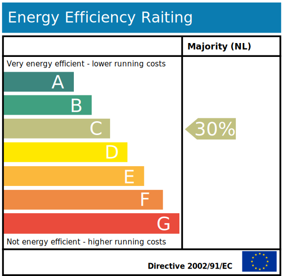

<link rel="stylesheet" href="/assets/js/openlayers/v4.6.5-dist/ol.css" />

# Energielabels voorspellen

## DISCLAIMER
De applicatie op deze pagina kan een **ruwe** inschatting maken van het energielabel van een woonhuis, op basis van enkel het bouwjaar en het pandoppervlak. Aan de inschattingen gemaakt in deze applicatie kunnen geen rechten worden ontleend. 

## Energielabels voor panden
Naast broodroosters en wasmachines kunnen ook panden over een energielabel beschikken. Het energielabel voor panden is een van de belangrijkste instrumenten in Europa om inzicht te krijgen in de energieconsumptie van huizen en panden. Velen hebben hier al kennis mee gemaakt: bij verkoop van een pand moet er een energielabel van dit pand bekend zijn. De labelindeling en het bijbehorende kleurenpalet is als volgt:

*Aangepast van [Wikipedia](https://en.wikipedia.org/wiki/Energy_Performance_Certificate_(United_Kingdom))*

## Energielabels en Machine Learning
Het blijkt niet eenvoudig om een model voor energielabels van woningen handmatig te *tunen* zodanig dat er betrouwbare voorspellingen uit komen. Toch is het met behulp van automatisch lerende algoritmes te doen: met behulp van een eenvoudige [decision tree](https://en.wikipedia.org/wiki/Decision_tree) en slechts het bouwjaar en oppervlak van een woonhuis is met een nauwkeurigheid van 81% een energielabel te voorspellen dat maximaal één label naast het daadwerkelijke label zit. Een exacte match is lastiger: op basis van enkel bouwjaar en oppervlak is slechts een nauwkeurigheid van 40% te geven. Let wel dat het model is getraind op enkel woningen, die voornamelijk door woningbouwcoorporaties zijn verzameld. Inschattingen met dit model op andere typen panden zoals fabrieksgebouwen of kantoren zijn onvoorspelbaar, maar waarschijnlijk zeer onbetrouwbaar.

**Beweeg de kaart om de voorspellingen te genereren.**

## Hoe werkt het?
Deze demo is gemaakt met enkel **open data en open source software**. We hebben een een eenvoudig decision tree model met een maximum diepte van 6 beslisstappen getraind op het zo goed mogelijk voorspellen van energielabels op basis van bouwjaar en pandoppervlak. Daartoe zijn energielabels gebruikt die de [Rijkdsdienst voor Ondernemend Nederland (RVO)](https://rvo.nl) verzamelt en ter beschikking heeft gesteld. Er is gewerkt met de energielabels van juni 2017. 
In kort bestek hebben we het volgende gedaan:
- Een decision tree [model](https://github.com/SPINLab/energy-performance-prediction/blob/master/model/energy_label_decision_tree_demo_model.py) is getraind, met behulp van [scikit-learn](http://scikit-learn.org).
- Het getrainde model is [met een script vertaald](https://github.com/SPINLab/energy-performance-prediction/blob/master/model/dtree_to_code.py) naar een geneste set [beslisregels in JavaScript](https://github.com/PDOK/data.labs.pdok.nl/blob/master/apps/energielabels/decisionTree.js).
- Dit model, getransformeerd naar JavaScript, wordt ingeladen in de browser bij het opvragen van deze pagina.
- Telkens als de kaart wordt verschoven, worden er nieuwe panden uit de [PDOK BAG WFS](http://nationaalgeoregister.nl/geonetwork/srv/dut/catalog.search#/metadata/1c0dcc64-91aa-4d44-a9e3-54355556f5e7) gehaald. De eigenschappen bouwjaar en oppervlak worden door de decision tree vertaald naar een inschatting van een energielabel. Voor het label wordt de bijbehorende kleurcode berekend en vervolgens wordt het pand in de kaart ingekleurd met deze kleur. 