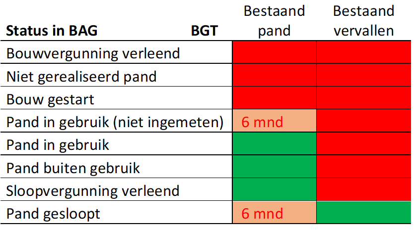

Deze datastory gaat verder in op het thema kwaliteit tussen de BGT en
de BAG

## Welke statussen mogen gecombineerd niet voorkomen.

Opmerking: Altijd de actuele voorkomens; in de BGT: Die hebben een
lege ‘registratieDatumVervallen’.

Query 1: Altijd fout: Query op BGT (bestaand vervallen) en BAG (pand
in gebruik, pand buiten gebruik, sloopvergunning verleend)

<query data-endpoint="https://data.labs.pdok.nl/sparql" data-query-ref="q1.rq" data-output="geo"></query>

Query 2: Fout (met tijd delta): Query op BGT (bestaand vervallen) en
BAG (pand in gebruik-niet ingemeten, en pand gesloopt) waarbij delta
in bron registratie datum meer dan 6 maanden is. (gradient yasgui)

Query 3: Signalerings query (zelfde als bij 2, maar dan binnen de 6
maanden). Oftewel die moet de bronhouder aanpassen.

<query data-endpoint="https://data.labs.pdok.nl/sparql" data-query-ref="q2.rq" data-output="geo"></query>

## Windturbines in de BAG

Één voorbeeld:

<query data-endpoint="https://data.labs.pdok.nl/sparql" data-query-ref="windturbine-bag1.rq" data-output="geo"></query>

Allemaal:

<query data-endpoint="https://data.labs.pdok.nl/sparql" data-query-ref="windturbine-bag2.rq" data-output="geo"></query>

Query 4: De BGT bevat ook de straatnaam, en die zou overgenomen moeten
zijn uit de BAG: Query: Geeft mij de straatnamen in de gemeente
Dronten waarbij verschil zit tussen de BGT en BAG straatnaam.

Query 5: Geometrische kwaliteitschecks: BGT pand moet altijd binnen
het BAG pand liggen. (dus geef me van een straat in flevoland de BGT
Panden die buiten het bijbehorende BAG pand liggen)
