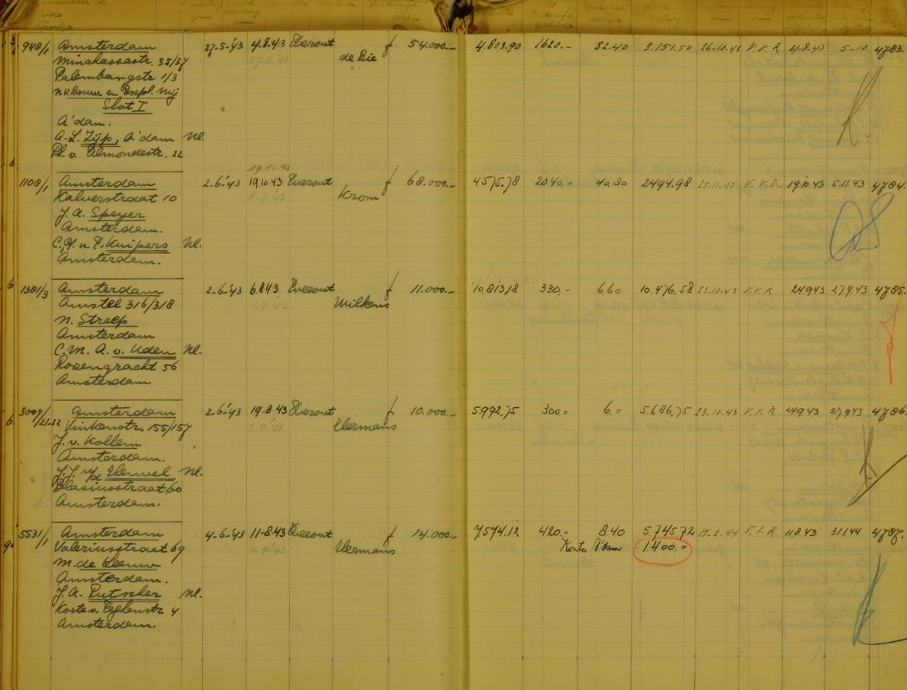
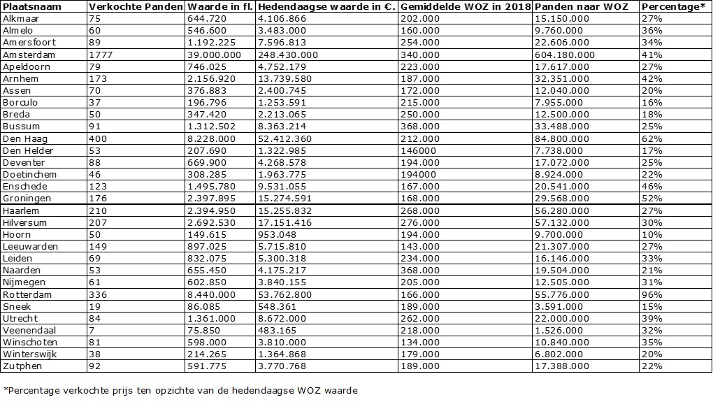

# Verkaufsbücher - Nationaal Archief

Tijdens de Tweede Wereldoorlog worden door de Duitsers panden verkocht waarvan de eigenaren veelal Joods zijn. De administratie hiervan staat in de zogeheten Verkaufsbücher die het Nationaal Archief bewaart. De bijgehouden administratie in de Verkaufsbücher bevat  7107 objecten: panden, bouwkavels, bos en heidegrond zijn te herleiden tot 1891 individuele (veelal Joodse) eigenaren waaruit - zoals het een gedegen administratie betaamt - onder andere naam eigenaar, straatnaam en woonplaats zijn te herleiden. Daar zijn de adressen en de namen van de betrokken notarissen en oorlogskopers en de verkoopprijzen van het onteigende pand toegevoegd.

De Verkaufsbücher is een openbare dataset. De inhoud is beschikbaar gesteld als open data met een [CC0 waiver](https://creativecommons.org/publicdomain/zero/1.0/deed.nl). Deze set is interessant vanwege het historisch belang maar ook om de inhoud die juist de wie, wat, waar en wanneer in zich heeft. Dit zijn de basisgegevens van een informatieobject en daarmee de eerste en belangrijkste gegevens om Linked Open Data van te maken. Daarnaast kunnen op basis van deze wie, wat waar en wanneer links gelegd worden met andere datasets zoals die van het Kadaster.

Het resultaat wat u hier ziet is ontstaan uit een samenwerking tussen het Nationaal Archief en het Kadaster. In september 2018 is het idee geopperd om een experiment te doen door Linked Open Data van het Kadaster te koppelen met data van het Nationaal Archief. Het Nationaal Archief wilde graag de Verkaufsbücher, vanwege het historisch belang, koppelen aan data van het Kadaster. In juli 2019 is hiervoor een High5 sessie georganiseerd van vier dagen.

Hieronder worden de volgende resultaten getoond: De onteigende panden op de kaart, de transacties van een koper en de gekochte panden en wie daar de eigenaar van was met een uitgelichte casus van de heer en mevrouw Hermans-Helsloot. Daarna volgen enkele statistieken over het aantal transacties per plaats, de kopers met de meeste transacties en  het verkoopbedrag versus de WOZ-waarde. We eindigen met een verslag van de High5 sessie die we hielden van 11-16 juli om deze webpagina te realiseren.

## Op de kaart tonen van onteigende panden

Een overzicht van de verhandelde objecten waarvan het adres gevonden is in de Basisregistraties Adressen en Gebouwen (BAG).

<query  data-config="https://data.labs.pdok.nl/stories/verkaufsbucher/#query=PREFIX%20foaf%3A%20%3Chttp%3A%2F%2Fxmlns.com%2Ffoaf%2F0.1%2F%3E%0APREFIX%20gsp%3A%20%3Chttp%3A%2F%2Fwww.opengis.net%2Font%2Fgeosparql%23%3E%0APREFIX%20owl%3A%20%3Chttp%3A%2F%2Fwww.w3.org%2F2002%2F07%2Fowl%23%3E%0APREFIX%20schema%3A%20%3Chttp%3A%2F%2Fschema.org%2F%3E%0APREFIX%20bag%3A%20%3Chttp%3A%2F%2Fbag.basisregistraties.overheid.nl%2Fdef%2Fbag%23%3E%0APREFIX%20vcard%3A%20%3Chttp%3A%2F%2Fwww.w3.org%2F2006%2Fvcard%2Fns%23%3E%0APREFIX%20rdf%3A%20%3Chttp%3A%2F%2Fwww.w3.org%2F1999%2F02%2F22-rdf-syntax-ns%23%3E%0APREFIX%20rdfs%3A%20%3Chttp%3A%2F%2Fwww.w3.org%2F2000%2F01%2Frdf-schema%23%3E%0APREFIX%20hg%3A%20%3Chttp%3A%2F%2Frdf.histograph.io%2F%3E%0Aprefix%20bbi%3A%20%3Chttp%3A%2F%2Fdata.pdok.nl%2Fdef%2Fbbi%23%3E%0APREFIX%20naa%3A%20%3Chttp%3A%2F%2Farchief.nl%2Fdef%2F%3E%20%0ASELECT%20%0A*%0AFROM%20%3Chttp%3A%2F%2Farchief.nl%2FNL-HaNA%2Fdoc%2FGraph%3AVerkaufsbucher%3E%0AFROM%20%3Chttp%3A%2F%2Farchief.nl%2Fverkaufsbucher%2Fid%2Fdataset%2Ftransactions%3E%0AFROM%20%3Chttp%3A%2F%2Fdata.pdok.nl%2Fbbi%2Fid%2Fdataset%2Fgemeente-woonplaats-relatie%3E%0AFROM%20%3Chttp%3A%2F%2Farchief.nl%2Fverkaufbuchen%2Fid%2Fdataset%2Flinkset-wpl-bagwpl-exact%3E%0AFROM%20%3Chttp%3A%2F%2Farchief.nl%2Fverkaufsbucher%2Fid%2Fdataset%2Flinkset-wpl-bagwpl-handmatig%3E%0AFROM%20%3Chttp%3A%2F%2Fdata.pdok.nl%2Fid%2Fdataset%2Fbbi%3E%0AFROM%20%3Chttp%3A%2F%2Fbrk.basisregistraties.overheid.nl%2Fid%2Fdataset%2Fbrk%2Fbestuurlijke-grenzen%2F2016%3E%0AFROM%20%3Chttp%3A%2F%2Farchief.nl%2Fverkaufsbucher%2Fid%2Fdataset%2Flinkset-adres-bag-nummeraanduiding%3E%0AFROM%20%3Chttp%3A%2F%2Farchief.nl%2Fverkaufsbucher%2Fid%2Fdataset%2Fverkaufsbucher-verkopersadressen%3E%0A%7B%0A%20%20%3Ftransactie%20%0A%20%20%20%20a%20schema%3ATradeAction%20%3B%0A%20%20%20%20schema%3Aobject%2Fvcard%3AhasAddress%20%3Fadres%20.%0A%20%20%3Fadres%0A%20%20%20%20naa%3AhasParcelCentroid%2Fgsp%3AasWKT%20%3Fshape%20.%0A%7D%0A&endpoint=https%3A%2F%2Fdata.labs.pdok.nl%2Fsparql&requestMethod=POST&tabTitle=Query&headers=%7B%7D&contentTypeConstruct=text%2Fturtle%2C*%2F*%3Bq%3D0.9&contentTypeSelect=application%2Fsparql-results%2Bjson%2C*%2F*%3Bq%3D0.9&outputFormat=geo&outputSettings=%7B%22map%22%3A%22nlmaps%22%2C%22visualization%22%3A%22grouped%22%2C%22grouped%22%3Afalse%7D"
        data-query-ref="bag-matched-object-overview.rq"
        data-output="geo">
</query>
        
In de hieronder staande kaart wordt voor een specifieke woonplaats weergegeven welke objecten (woningen, bouwland etc.) onteigend zijn. Wanneer je op een marker op de kaart klikt wordt er voor dat object informatie getoond, afkomstig van het Nationaal Archief en van het Kadaster.

We zoomen nu in op Utrecht, maar de query kan aangepast worden naar een willekeurige woonplaats. Dit kan door via de pijl-symbool boven de onderstaande kaart de query open te klappen en op regel 32 de woonplaats aan te passen. Daarna druk je op de play-knop om de nieuwe query te draaien.

<query  data-query-ref="regio-transactie-overzicht.rq"
        data-output="geo"> 
</query>

## Relatie tussen koper en verkoper visueel weergeven op de kaart

In de Verkaufsbücher is per pand bijgehouden wie de eigenaar was en zijn woonadres. Ook de adresgegevens en de naam van de koper van het object zijn genoteerd. Door deze gegevens op de kaart te visualiseren wordt de relatie tussen kopers en verkopers zichtbaar. Woonden kopers en verkopers bijvoorbeeld in elkaars nabijheid? Oftewel, kochten kopers de huizen van hun buurtgenoten? 

Als je op de kaart een eigenaar bekijkt (<svg height="18" viewBox="0 0 18 18" xmlns="http://www.w3.org/2000/svg"><circle cx="9" cy="9" fill="#008000" r="9"/></svg>), dan kun je de lijntjes volgen naar de panden (<svg height="18" viewBox="0 0 18 18" xmlns="http://www.w3.org/2000/svg"><circle cx="9" cy="9" fill="#808080" r="9"/></svg>) en door naar de adressen van de kopers (<svg height="18" viewBox="0 0 18 18" xmlns="http://www.w3.org/2000/svg"><circle cx="9" cy="9" fill="#800080" r="9"/></svg>) en vice versa.

<query  data-query-ref="koper-verkoper-per-wpl.rq"
        data-output="geo">
</query>

### De casus Hermans-Helsloot

Piersma en Kemperman (2105) beschrijven een interessante casus betreffende de onteigening van Joods bezit en de verkoop van panden.
[https://pure.knaw.nl/portal/files/1637622/PiersmaKemperman_2015_OpenstaandeRekeningen.pdf](https://pure.knaw.nl/portal/files/1637622/PiersmaKemperman_2015_OpenstaandeRekeningen.pdf)

"Als gevolg van de ontrechting van Joden ontstond er een levendige tussenhandel in Joods eigendom. Deze handel trok mensen aan van allerlei slag, soms met een louche achtergrond. Dat blijkt uit de dossiers die ten behoeve van hun naoorlogse berechting werden opgemaakt. Een van die tussenhandelaren was de advocaat E.Th.A. (Emile) Hermans. Het was hem voor de oorlog financieel niet voor de wind gegaan, maar met de Duitse bezetting rook hij zijn kansen op de nieuwe markt van geroofd Joods onroerend goed. Met Everout zou hij gedurende de bezettingsjaren goede zaken doen. Hermans was vanaf 1933 lid van de nsb en was een hardliner en een vechtersbaas – in 1935 verloor hij tijdens een vechtpartij in Laren een oog. Sindsdien ging hij met een glazen exemplaar door het leven. Hoewel Hermans na de oorlog zou verklaren dat hij geen ‘Jodenhater’ was, bleek hij niet te beroerd om de Duitsers behulpzaam te zijn bij hun anti-Joodse politiek. [...]  
Begin 1941 raakte Hermans betrokken bij de liquidatie van door de Duitsers verboden organisaties. Het kostte hem een kantoorruit, die met een steen aan diggelen werd gegooid. Hermans verklaarde tegenover de politie dat deze daad waarschijnlijk te maken had met zijn bemoeienis met de opheffing van de vrijmetselarij. Dit genootschap werd door de Duitsers als volksvijandig en Joods gezien, en moest daarom het veld ruimen. Hermans zou er als liquidateur zo’n 25.000 gulden mee verdienen. Met een dergelijk kapitaal was het niet moeilijk huizen van onteigende Joden op te kopen. Dat deed Hermans dan ook veelvuldig. Hij was betrokken bij de verkoop van zo’n tweehonderd panden. Hierbij werkte hij nauw samen met zijn echtgenote en de makelaar A. Groenewegen. Ook al regelde Hermans alle praktische zaken zelf, naar buiten toe opereerden mevrouw Hermans-Helsloot en Groenewegen als duo, waarbij Groenewegen de verkoper was en Hermans-Helsloot de eigenaresse van de panden die ze zogenaamd al jaren in haar bezit had. 
Op de panden die werden gekocht en doorverkocht werden forse winsten gemaakt, ook omdat het trio erin slaagde om in tal van gevallen de kopers ervan te overtuigen dat er geen sprake was van Joods eigendom. Een aantal panden kocht het echtpaar om zelf te houden. Hermans-Helsloot noemde er na de oorlog twee in de Utrechtsestraat (de nummers 72 en 74). Hermans kocht tevens een dubbelhuis aan het Albert Hahnplantsoen dat eigendom was van de koopman Jacob Polak. Ook al was ‘arisering’ het officiële doel van de verkoop van Joods onroerend goed, het maakte het drietal in de praktijk weinig uit met wie zij zaken deden. Volgens een getuige in het naoorlogse gerechtelijke onderzoek tegen Everout had met name Groenewegen een grote diversiteit aan klanten. Ze varieerden van ‘Italiaanse ijsventers’ tot ‘Chinese zwarthandelaren’, die hij niet kon verstaan, ‘maar die hem waarschijnlijk ook niet verstonden, want hij [Groenewegen] heeft een heel ernstig spraakgebrek’. Een vreemd team derhalve: een advocaat met een glazen oog en een verkoper met een spraakstoornis."

<query  data-query-ref="persoon-focus.rq"
        data-output="geo">
</query>

Ook in het Historisch Nieuwsblad is een artikel verschenen over het criminele vastgoed circuit en de Jodenvervolging in de tweede wereldoorlog. [https://www.historischnieuwsblad.nl/nl/artikel/24891/crimineel-vastgoedcircuit-verdiende-grof-geld-aan-jodenvervolging.html](https://www.historischnieuwsblad.nl/nl/artikel/24891/crimineel-vastgoedcircuit-verdiende-grof-geld-aan-jodenvervolging.html)

## Statistieken

### Aantal transacties per plaats

Het aantal transacties per plaats kon al worden opgemaakt uit de papieren Verkaufsbücher. Door deze dataset verder uit te werken is meer inzicht gegeven over de aard van de transacties en de betrokkenen bij die transacties.
In onderstaande tabel is een overzicht gegeven per plaats over het aantal panden dat verhandeld is binnen de transacties die in de Verkaufsbücher genoemd zijn. Daarnaast is inzicht gegeven over waar de kopers en verkopers van die panden vandaan komen. Als laatste is inzicht gegeven over de waarde van de transactie die in die plaats hebben plaats gevonden. Deze informatie geeft per gemeente inzicht hoe de verhouding tussen deze verschillende aspecten is.

In de tabel is Amsterdam dominant aanwezig waardoor inzicht in de andere plaatsen wordt beperkt. Het is voor de gebruiker mogelijk om via de pijl-symbool boven de tabel de query aan te passen. Nadat de query zichtbaar is kunt u onderaan de query de “ OFFSET” verhogen van 0 naar 1. Wanneer de query via het pijl-symbool rechtsboven aan opnieuw wordt uitgevoerd verschijnt een nieuwe weergave van de tabel zonder Amsterdam. De resterende plaatsen geven nu meer inzicht in de  transacties.

<query  data-config="http://yasgui.org/#query=PREFIX+rdf%3A+%3Chttp%3A%2F%2Fwww.w3.org%2F1999%2F02%2F22-rdf-syntax-ns%23%3E%0APREFIX+rdfs%3A+%3Chttp%3A%2F%2Fwww.w3.org%2F2000%2F01%2Frdf-schema%23%3E%0APREFIX+xsd%3A+%3Chttp%3A%2F%2Fwww.w3.org%2F2001%2FXMLSchema%23%3E%0APREFIX+schema%3A+%3Chttp%3A%2F%2Fschema.org%2F%3E%0APREFIX+hg%3A+%3Chttp%3A%2F%2Frdf.histograph.io%2F%3E%0APREFIX+dct%3A+%3Chttp%3A%2F%2Fpurl.org%2Fdc%2Fterms%2F%3E%0APREFIX+foaf%3A+%3Chttp%3A%2F%2Fxmlns.com%2Ffoaf%2F0.1%2F%3E%0APREFIX+bag%3A+%3Chttp%3A%2F%2Fbag.basisregistraties.overheid.nl%2Fdef%2Fbag%23%3E%0APREFIX+vcard%3A+%3Chttp%3A%2F%2Fwww.w3.org%2F2006%2Fvcard%2Fns%23%3E%0APREFIX+naa%3A%09%3Chttp%3A%2F%2Farchief.nl%2Fdef%2F%3E%0A%0ASELECT+%3FplaatsnaamObject+(count(%3Ftradeaction)+AS+%3FnumVerkochtePanden)+(count(%3FtransactieObjectInPlaats)+AS+%3FnumKopersInPlaats)+(count(%3FtransactieObjectBuitenPlaats)+AS+%3FnumKopersBuitenPlaats)+(xsd%3Ainteger(sum(%3FprijsObject)%2F20000)+AS+%3FtotWaardeTransactie)+WHERE+%0A%7B%0A++%09%09%7B%0A++++%09%09%3Ftradeaction+a+schema%3ATradeAction+%3B%0A+++++++++++++++++schema%3Aobject%2Fdct%3Atype+hg%3ABuilding+%3B%0A+++++++++++++++++schema%3Aobject%2Fvcard%3AhasAddress%2Fvcard%3Alocality+%3FplaatsnaamObject+%3B%0A++++%09%09%09+naa%3AsellingPrice+%3FprijsObject+.%0A++%09%09%7D%0A++%09%09UNION%0A%09%09%7B%0A%09%09++++%3FtransactieObjectInPlaats+a+schema%3ATradeAction+%3B%0A+++++++++++++++++schema%3Aobject%2Fdct%3Atype+hg%3ABuilding+%3B%0A+++++++++++++++++schema%3Abuyer%2Fvcard%3AhasAddress%2Fvcard%3Alocality+%3FplaatsnaamObject+.+%0A%0A%09%09%7D%0A++++%09UNION%0A%09%09%7B%0A%09%09++++%3FtransactieObjectBuitenPlaats+a+schema%3ATradeAction+%3B%0A+++++++++++++++++schema%3Aobject%2Fdct%3Atype+hg%3ABuilding+%3B%0A+++++++++++++++++schema%3Aobject%2Fvcard%3AhasAddress%2Fvcard%3Alocality+%3FplaatsnaamObject+%3B%0A+++++++++++++++++schema%3Abuyer%2Fvcard%3AhasAddress%2Fvcard%3Alocality+%3FplaatsnaamKoperObject+.+%0A++++%0A++++%09%09filter+(%3FplaatsnaamObject+!%3D+%3FplaatsnaamKoperObject)%0A%09%09%7D%0A++%0A%7D+%0AGROUPBY+%3FplaatsnaamObject%0AORDERBY+desc(%3FnumVerkochtePanden)%0AOFFSET+0%0ALIMIT+20&contentTypeConstruct=text%2Fturtle&contentTypeSelect=application%2Fsparql-results%2Bjson&endpoint=https%3A%2F%2Fdata.labs.pdok.nl%2Fsparql&requestMethod=POST&tabTitle=Zandbak+2&headers=%7B%7D&outputFormat=gchart&outputSettings=%7B%22chartConfig%22%3A%7B%22options%22%3A%7B%22hAxis%22%3A%7B%22viewWindow%22%3Anull%2C%22useFormatFromData%22%3Atrue%2C%22minValue%22%3Anull%2C%22maxValue%22%3Anull%2C%22viewWindowMode%22%3Anull%7D%2C%22legacyScatterChartLabels%22%3Atrue%2C%22legend%22%3A%22bottom%22%2C%22vAxes%22%3A%5B%7B%22title%22%3Anull%2C%22minValue%22%3Anull%2C%22maxValue%22%3Anull%2C%22viewWindow%22%3A%7B%22max%22%3Anull%2C%22min%22%3Anull%7D%2C%22useFormatFromData%22%3Atrue%2C%22logScale%22%3Afalse%7D%2C%7B%22viewWindow%22%3A%7B%22max%22%3Anull%2C%22min%22%3Anull%7D%2C%22minValue%22%3Anull%2C%22maxValue%22%3Anull%2C%22useFormatFromData%22%3Atrue%2C%22logScale%22%3Afalse%7D%5D%2C%22isStacked%22%3Afalse%2C%22booleanRole%22%3A%22certainty%22%2C%22width%22%3A600%2C%22height%22%3A371%2C%22legendTextStyle%22%3A%7B%22color%22%3A%22%23222%22%2C%22fontSize%22%3A%229%22%7D%7D%2C%22state%22%3A%7B%7D%2C%22view%22%3A%7B%22columns%22%3Anull%2C%22rows%22%3Anull%7D%2C%22isDefaultVisualization%22%3Afalse%2C%22chartType%22%3A%22ColumnChart%22%7D%2C%22motionChartState%22%3Anull%7D"
        data-query-ref="aantal_panden_tabel.rq"
        data-output="gchart">
</query>

### Maatschappelijke relevantie
De gemeente Den Haag heeft onlangs 2,6 miljoen euro gereserveerd voor schadevergoedingen aan Joodse slachtoffers die na de oorlog een aanslag kregen om alsnog hun erfpacht te betalen. Zie het artikel hierover in de Volkskrant: [https://www.volkskrant.nl/a-b7e75c47](https://www.volkskrant.nl/a-b7e75c47)

Ook andere gemeenten zoals Rotterdam en Utrecht werken aan een schaderegeling. Met de gegevens die we nu hebben kunnen we het mogelijk maken om op basis van het aantal m2  van de panden de hoogte van de vergoeding vast te stellen. Met een link tussen de adressen en eigenaren van geroofde panden uit de Verkaufsbücher en de oppervlakte uit de BAG is een inschatting te maken van het totaal uit te keren (en reserveren) bedrag.

Voorbeeld: In de gemeente Utrecht zijn 81 panden met in totaal een oppervlakte van 13.559 m2 verkocht. Bij 100 euro per m2 is dat ruim 1,3 miljoen euro, te verdelen over de eigenaren of hun nabestaanden.

<query  data-query-ref="oppervlakte_objecten_plaats.rq">
</query>

### Kopers met de meeste panden

Dit is een Top20-lijst van de kopers met de meeste panden/transacties. Hierbij is per record in de Verkaufsbücher bekeken welke koper een transactie heeft gedaan waarna vervolgens het totaal van de transacties per koper is berekend. Hiernaast is in de Verkaufsbucher ook aangegeven welk bedrag de koper heeft betaald voor de transactie. Het totaalbedrag van de transacties is per koper aangegeven.
In de tabel zijn er een aantal opvallendheden. Zo is bijvoorbeeld de persoon B.E.M. Hermans-Helsloot ook bekend onder de namen B.P.M. Hermans-Helsloot en E.T.A. Hermans. Dit zijn dezelfde personen maar komen voor op aparte regels in de tabel.

<query  data-config= "http://yasgui.org/#query=PREFIX+vcard%3A+%3Chttp%3A%2F%2Fwww.w3.org%2F2006%2Fvcard%2Fns%23%3E%0APREFIX+foaf%3A+%3Chttp%3A%2F%2Fxmlns.com%2Ffoaf%2F0.1%2F%3E%0APREFIX+skos%3A+%3Chttp%3A%2F%2Fwww.w3.org%2F2004%2F02%2Fskos%2Fcore%23%3E%0APREFIX+schema%3A+%3Chttp%3A%2F%2Fschema.org%2F%3E%0APREFIX+bag%3A+%3Chttp%3A%2F%2Fbag.basisregistraties.overheid.nl%2Fdef%2Fbag%23%3E%0APREFIX+rdf%3A+%3Chttp%3A%2F%2Fwww.w3.org%2F1999%2F02%2F22-rdf-syntax-ns%23%3E%0APREFIX+rdfs%3A+%3Chttp%3A%2F%2Fwww.w3.org%2F2000%2F01%2Frdf-schema%23%3E%0APREFIX+naa%3A%09%3Chttp%3A%2F%2Farchief.nl%2Fdef%2F%3E%0A%0ASELECT+%3Fkoper+(xsd%3Ainteger(sum(%3FprijsObject)%2F100000)+AS+%3Ftotaal_waarde_100K)+(count(%3Ftransactie)+AS+%3Ftransacties)+WHERE+%7B%0A+%0A%09%3Ftransactie+a+schema%3ATradeAction%3B%09%0A+++++++++++++naa%3AsellingPrice+%3FprijsObject%3B%0A+++++++++++++schema%3Abuyer+%3FkoperURI.%09%0A++++%3FkoperURI+skos%3AprefLabel+%3Fkoper%3B%0A++++FILTER(%3Fkoper+!%3D+%22%22)++++++%0A%0A%7D+%0AGROUPBY+%3Fkoper%0AORDERBY+desc(%3Ftotaal_waarde_100K)%0ALIMIT+25&contentTypeConstruct=text%2Fturtle&contentTypeSelect=application%2Fsparql-results%2Bjson&endpoint=https%3A%2F%2Fdata.labs.pdok.nl%2Fsparql&requestMethod=POST&tabTitle=Koper%2FTransacties&headers=%7B%7D&outputFormat=gchart&outputSettings=%7B%22chartConfig%22%3A%7B%22options%22%3A%7B%22hAxis%22%3A%7B%22useFormatFromData%22%3Atrue%2C%22minValue%22%3Anull%2C%22maxValue%22%3Anull%2C%22viewWindow%22%3Anull%2C%22viewWindowMode%22%3Anull%7D%2C%22legacyScatterChartLabels%22%3Atrue%2C%22vAxes%22%3A%5B%7B%22useFormatFromData%22%3Atrue%2C%22viewWindow%22%3A%7B%22max%22%3Anull%2C%22min%22%3Anull%7D%2C%22minValue%22%3Anull%2C%22maxValue%22%3Anull%2C%22logScale%22%3Afalse%7D%2C%7B%22useFormatFromData%22%3Atrue%2C%22viewWindow%22%3A%7B%22max%22%3Anull%2C%22min%22%3Anull%7D%2C%22minValue%22%3Anull%2C%22maxValue%22%3Anull%2C%22logScale%22%3Afalse%7D%5D%2C%22isStacked%22%3Atrue%2C%22booleanRole%22%3A%22certainty%22%2C%22legend%22%3A%22right%22%2C%22width%22%3A600%2C%22height%22%3A371%7D%2C%22state%22%3A%7B%7D%2C%22view%22%3A%7B%22columns%22%3Anull%2C%22rows%22%3Anull%7D%2C%22isDefaultVisualization%22%3Afalse%2C%22chartType%22%3A%22ColumnChart%22%7D%2C%22motionChartState%22%3Anull%7D"
        data-query-ref="kopers_panden.rq"
        data-output="gchart">
</query>

### Verkoopbedrag versus WOZ-waarde

De indruk bestaat dat de panden uit de Verkaufsbücher voor een schijntje zijn verkocht. Is dat ook zo?

Met de omrekentabel van IISG is het bedrag uit het Verkaufsbuch omgerekend rekening houdend met inflatie en deflatie en kan worden vergeleken met de (gemiddelde) WOZ-waarde van januari 2018.
(Bron CBS: [https://www.cbs.nl/nl-nl/nieuws/2018/34/woningwaarde-in-2018-gemiddeld-6-5-procent-omhoog](https://www.cbs.nl/nl-nl/nieuws/2018/34/woningwaarde-in-2018-gemiddeld-6-5-procent-omhoog))

Gemiddeld werden woningen verkocht (omgerekend naar het hedendaagse prijspeil) voor 35-40% van de WOZ-waarde.

## Verslag High5 Kadaster en Nationaal Archief

Op donderdag 11 juli 2019 zijn we van start gegaan met de High5 sessie, dit is een sessie waarin binnen vier dagen een resultaat behaald dient te worden op basis van user stories. Allereerst hebben we met elkaar kennis gemaakt. Van het Kadaster waren aanwezig: Babette van Alphen, Pano Maria, Nathan van Dalen, Roel Stap. Van het NA waren aanwezig: Tim de Haan, Fairoesh Nanhekhan en Ed de Heer.

Als eerste hebben we ons gebogen over de mogelijke userstories. De volgende kwamen naar boven en staan op volgorde van belangrijkheid:
- Visualisatie van de panden op de kaart
- Relaties tussen pandeigenaren en kopers
- Statistieken over totaal aantal verhandelde panden en de waarde ervan
- Een link naar biografische gegevens en Stolpersteine

De volgende acties hebben we (moeten) doen om de koppeling tussen de 7100 records met informatie over onteigende panden van het NA en de Basisregistratie Adressen en Gebouwen (BAG) van het Kadaster te realiseren. 

Met behulp van OpenRefine waren de adressen al ‘opgepoetst’, maar er bleven nog steeds lastige gevallen over:
- plaatsnamen met een andere spellingswijze
- plaatsen die zijn opgegaan in gemeenten
- straatnamen met afkortingen en verschillende schrijfwijzen
- historische straatnamen of schrijfwijze
- transacties waarbij meerdere panden werden verkocht.

Handmatig zijn tijdens de High5 160 plaatsnamen gekoppeld aan plaatsnamen in de BAG, een locatie uit Wikidata of aan de gemeentecode.

Met behulp van een script is de Locatieserver gevraagd naar suggesties voor de adressen uit de Verkaufsbücher, zodat die kunnen worden aangevuld met een postcode. Na een eerste actie werden 6923  adressen ‘gematcht’. Transacties uit de Verkaufsbücher met een combinatie van panden zoals Amstel 216-318 of straatnamen die uit twee delen bestaan zoals de Nieuwe Keizersgracht 74 leverden geen betrouwbaar resultaat op. Hiervoor was een tweede actie nodig om de afzonderlijke adressen te genereren. Ruim twee derde van de adressen uit de Verkaufsbücher met een afwijkende schrijfwijze zijn uiteindelijk achterhaald en daarmee te tonen op de kaart. Van de 13051 adressen hebben we er uiteindelijk 10581 gematcht. 

Het bleek dat De Construct query die het NA gebruikt om de Verkaufsbücher te maken andere kolomnamen bevatte dan in de dataset zelf. Een header in het csv-bestand gooide roet in het eten. Dit is uiteindelijk gefixt. 

Controle in de originele scan van de Verkaufsbücher om een afwijkende waarde te controleren. Deze afwijking dook op bij de visualisatie van de relaties (pand, koper, verkoper) op aan de Amstel (no. 216 -318) en bleek bij een extra check op de originele data een typefout te zijn. Het correcte adres betreft Amstel 316 -318. 

Er is uitgezocht wat de WOZ waarde tegenwoordig is van de onteigende panden per plaats om zo inzichtelijk te krijgen hoeveel de  panden toen onder de daadwerkelijke waarde verkocht zijn. Dit is berekend voor zo’n 60% van alle panden oftewel de 30 gemeenten met de meeste panden.

De Duitsers hernoemden in de oorlog Nederlandse straten. De Sarphatistraat werd door de Duitsers bijvoorbeeld Muiderschans genoemd. Deze historische adressen zijn voor Amsterdam omgezet naar de huidige straatnamen. (Voor andere gemeenten is geen koppeltabel beschikbaar.)
Een aandachtspunt is de jaren ‘40 schrijfwijze van straatnamen (spelling Marchant). Denk aan Groote Markt of Rijswijkscheplein. Ook deze straatnamen zijn in de datastory verwerkt. Nu resteren nog de straatnamen en panden die in of na de oorlog zijn verdwenen.

Er is tijdens de High5 ook onderzoek gedaan naar het Joods Monument en de Stolpersteine om een link te leggen naar biografische gegevens over omgekomen Joodse slachtoffers. Uiteindelijk bleek de tijd niet toereikend voor het leggen van links met de Stolpersteine en met het Joods monument.
